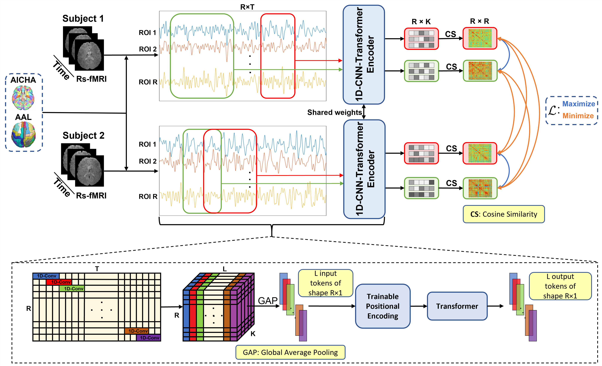

# VarCoNet
This repository includes all code related to our paper: VarCoNet: A variability-aware self-supervised framework for functional connectome extraction from resting-state fMRI. The paper is currently under review.
Code developed and tested in Python 3.11.8 using PyTorch 2.1.2. Below are some necessary requirements.

```python
numpy == 1.26.4
scikit-learn == 1.5.2
optuna == 4.1.0
pytorch-lightning == 1.9.5
nibabel == 5.3.2
nilearn == 0.11.1
lightning-bolts == 0.7.0
pandas == 2.2.3
wandb == 0.16.6
```

# Block diagram


# Download preprocessed fMRI data
- Preprocessed HCP data can be downloaded from the official webiste of the HCP: https://db.humanconnectome.org . One need to create an account to download the data. Once logged in, one can click the "Subjects with 3T MR session data" option at the "WU-Minn HCP Data - 1200 Subjects" panel and then select the following packages to download: Resting State fMRI 1 Preprocessed and Resting State fMRI 2 Preprocessed. These packages have size 6492.25 GB and 6112.31 GB, respectively. Phenotypic information can also be downloaded from the same site. Click the "WU-Minn HCP Data - 1200 Subjects" and then download "Behavioral Data" from Quick downloads
- Preprocessed ABIDE I data can be downloaded following the instructions in https://preprocessed-connectomes-project.org/abide/download.html . Specifically, one can download for free the cyberduck software (https://cyberduck.io/). Following, one can open cyberduck -> Open Connection -> FTP (choose Amazon S3) -> Access Key ID (anonymous) -> Path -> /fcp-indi/data/Projects/ABIDE/Outputs/fmriprep. One should see two folders, one named "fmriprep" and one named "freesurfer". One can proceed with downloading the "fmriprep" folder. Phenotypic information can also be downloaded from the cyberduck application (full path: /fcp-indi/data/Projects/ABIDE/Phenotypic_V1_0B_preprocessed1.csv)
- Preprocessed ABIDE II data can be downloaded following the exact same procedure as above but change the path to /fcp-indi/data/Projects/ABIDE2/Outputs/fmriprep . Phenotypic information can be downloaded from https://fcon_1000.projects.nitrc.org/indi/abide/abide_II.html ("ABIDE II Composite Phenotypic File" under phenotypic data, under ABIDE II downloads).

# Download atlases
The two atlases (AICHA and AAL3) can be downloaded from (https://www.gin.cnrs.fr/en/tools/aicha/ and https://www.oxcns.org/aal3.html).

# Parcellate and filter fMRI data
- HCP. Considering that there are two folders REST1 and REST2 at certain locations containing the downloaded files, one can run the data_preparations/parcellate_HCP.py script to extract the time-series from the ROIs of the selected atlas, giving as input the path to these folders, the path to the atlas and the output directory. Following, one should run the data_preparations/subsampling_HCP.py script to downsample data to a TR of 1.5 s, giving as input the path to the output directory from the previous script.
- ABIDE I. Considering there is a folder named fmriprep (downloaded from cyberduck) at a certain location and a .csv phenotypic file, one can run the data_preparations/parcellate_ABIDEI.py script to extract the time-series from the ROIs of the selected atlas, giving as input the path to the fmriprep folder, the path to the atlas, the path to the phenotypic file and the output directory.
- ABIDE II. Considering there is a folder named fmriprep (downloaded from cyberduck) at a certain location and a .csv phenotypic file, one can run the data_preparations/parcellate_ABIDEII.py script to extract the time-series from the ROIs of the selected atlas, giving as input the path to the fmriprep folder, the path to the atlas, the path to the phenotypic file and the output directory.

# Prepare data to be fed to the DL models
- HCP. Run the script data_preparations/prepare_HCP_data.py using as inputs the path of the output directory from the data_preparations/parcellate_HCP.py and an output directory
- ABIDE I. Run the script data_preparations/prepare_ABIDEI_data.py using as inputs the path of the output directory from the data_preparations/parcellate_ABIDEI.py and an output directory
- ABIDE II. Run the script data_preparations/prepare_ABIDEII_data.py using as inputs the path of the output directory from the data_preparations/parcellate_ABIDEII.py and an output directory

# Run Bayesian optimization to find suitable values for hyperparameters
One can run the VarCoNet_BO.py script. This script saves two .pkl files, one containing the best values for the examined hyperparameters and one containing information for all trials. This script requires the following inputs:
```python
config = {}
config['path_data'] = r'.../HCP'
config['atlas'] = 'AICHA' #AICHA, AAL
config['train_length_limits'] = [30,320]
config['test_lengths'] = [30,175,320]
config['test_num_winds'] = 10
config['shuffle'] = True
config['epochs'] = 200
config['warm_up_epochs'] = 10
config['eval_epochs'] = list(range(10,config['epochs']+1))
config['device'] = "cuda:0"
```

# Train and test VarCoNet for subject fingerprinting using HCP data
**For all following scripts, it is important to use the same --path_save!!!**
To apply VarCoNet on the HCP data one can run:
```python
python -m subject_fingerprinting \ 
  --path_data .../HCP \
  --path_save .../FOLDER \
  --atlas AICHA \
  --save_models \
  --save_results
```
There are additional input arguments that one can set. For more information check the script.

# Run ablations on subject fingerprinting
To run the ablation experiments one can run:
```python
python -m subject_fingerprinting_ablations \ 
  --path_data .../HCP \
  --path_save .../FOLDER \
  --save_results
```
There are additional input arguments that one can set. For more information check the script.

# Train and test VarCoNet for ASD classification using ABIDE I data
To apply VarCoNet on the ABIDE I data one can run:
```python
python -m ASD_classification_ABIDEI \ 
  --path_data .../ABIDEI \
  --path_save .../FOLDER \
  --atlas AICHA \
  --save_models \
  --save_results
```
There are additional input arguments that one can set. For more information check the script.

# Run ablations on ASD classification
To run the ablation experiments one can run:
```python
python -m ASD_classification_ablations \ 
  --path_data .../ABIDEI \
  --path_save .../FOLDER \
  --save_results
```
There are additional input arguments that one can set. For more information check the script.

# Train and test BolT on ASD classification using ABIDE I data
To apply BolT on the ABIDE I data one can run:
```python
python -m competing_methods.bolt \ 
  --path_data .../ABIDEI \
  --path_save .../FOLDER \
  --atlas AICHA \
  --save_models \
  --save_results
```
There are additional input arguments that one can set. For more information check the script. Other competing methods can also be run using a similar format.

# Exteral testing on ABIDE II
To test BolT and VarCoNet on ABIDE II run:
```python
python -m ASD_classification_ABIDEII \ 
  --path_data .../ABIDEII \
  --path_save .../FOLDER \ 
  --save_results
```

# Prediction stability
To calculate prediction stability please run:
```python
python -m predictions_stability \ 
  --path_data .../ABIDEI \
  --path_save .../FOLDER \ 
  --save_results
```
There are additional input arguments that one can set. For more information check the script. Other competing methods can also be run using a similar format.

**For all these scripts, it is important to use the same --path_save!!!**

# Extracting and plotting results
Scripts to extract and plot results exist in the result_scripts folder. Running them is quite straightforward. All of them require the path_save were all previous scripts saved their results. 
- ablation_plots.py: illustrates the results of the ablation experiments.
- ASD_feature_importance: saves a .csv file containing the importance of each connection among brain regions
- BO_plot.py: creates a project (e.g. VarCoNet-V2-AICHA-BO-plot_final) that can be accessed at https://wandb.ai . One can open this project and then click "add panels" and select the "parallel coordinates" option. Then click the "add column" button until all columns are added. This will result to adding some non useful columns that can then be removed. The final column should be "Obj. Func.".
- display_results_ABIDE: this script prints the resuls on ASD classification
- intra_inter_subject_similarities.py: this scripts illustrates the intra-inter subject similarity matrices
- plot_fingerprinting_results.py: this script plots the results of the subject fingerprinting tests
- prepare_for_rex.py: this script prepares the inputs for the ReX toolbox (the ReX toolbox can be downloaded from: https://github.com/TingsterX/Reliability_Explorer)
- rex_plots.R and rex_plots_2.R: these scripts use ReX to visualise intra-class correlation and the gradient flow map of the individual variation field
- prepare_for_BrainNetViewer.R: this script takes as input the .csv file containing feature importance values and the locations to the files AAL3_coords.npy and AICHA_coords.npy and creates files ready to be used by the BrainNetViewer toolbox

# Replicating our results
All data produced by the abovementioned scripts can be downloaded from the following link: https://drive.google.com/drive/folders/1uA63W0x96oI8LwWqD45k3DWM8IFGzndm?usp=sharing. Moreover, all our results and weights of our trained models can be downloaded from the following link: https://drive.google.com/drive/folders/1uA63W0x96oI8LwWqD45k3DWM8IFGzndm?usp=sharing. The .npy files that inlude the results of ASD classification also include the IDs of the subjects used for training, validation and testing, at each fold of the 10-fold CV. In this way we enable future studies to directly compare their models to ours (by using the same subjects for training, validation and testing), thus eliminating the need to run our code from scratch. In contrast, one can directly use the results extracted from the abovementioned scripts, when applied to the files downloaded from the aforementioned link. 

If you have any inquiry, encouter an error or need help understanding how to use this repository don't hesitate to contact us at: xaralabos10@hotmail.gr or charalampos.lamprou@ku.ac.ae


